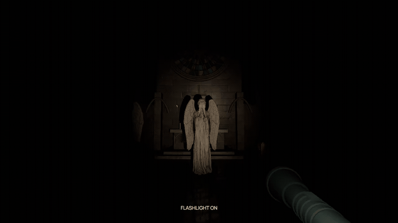
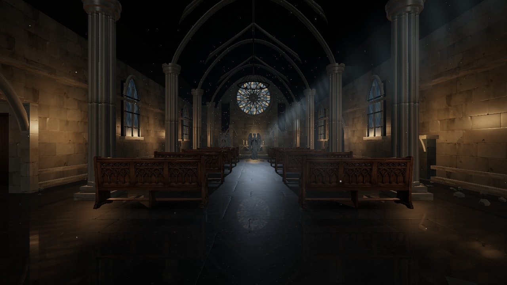
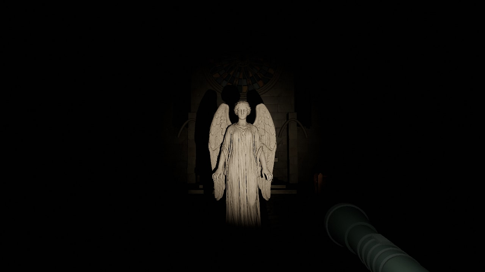

# Don't Look Away

**Two angels. Ten seconds of candlelight. One flashlight.**

A playable browser horror experiment built with **fal**, **GPT-6-Astra in Codex**, and **Three.js**. You enter Saint Orison's chapel, look away from its statues, and discover that they have moved. Then the candles go out.



*Actual gameplay capture with a rehearsed camera position. The game's visibility, movement, flashlight and blink rules drive the encounter.*

**[Play the demo in your browser](https://weeping-angels.vercel.app/)**

Desktop keyboard and mouse required. Headphones recommended. Includes sudden darkness, threatening imagery and jump scares.

## Inside the chapel



The angels freeze whenever any part of them can be seen, including a wing beside a column or a reflection on the damp floor. Looking away or blinking gives them a chance to move. In complete darkness, looking in their direction is not enough: you need light to see them.

The opening reaches full darkness about **10 seconds into active gameplay**. A flashlight reveals where the statues have gone. Stone scrapes are positional, breathing becomes strained, and a heartbeat starts after you witness an angel change position or pose.



There is also a short escape objective: restore the electrical supply in the sacristy, collect the gate key in the archive, and return to the entrance. The blackout trips any power restored before it; restoring the supply afterward brings back the service lights. Pausing or switching tabs freezes gameplay.

This is an experimental desktop demo. Close-range capture still needs tuning; further encounter and progression work is planned.

## Stack at a glance

| Layer | Technology | What it does here |
| --- | --- | --- |
| Development | GPT-6-Astra in Codex | Collaborative implementation, scene construction, asset-pipeline scripts, Blender pose work, iteration and debugging |
| Asset generation | fal | One production API for reference images, 3D models, surface materials and sound effects |
| Game and renderer | Three.js 0.185.1 + TypeScript | Scene graph, WebGL rendering, first-person camera, visibility, navigation, collision and interactions |
| Scene lighting | Three.js lights and custom shaders | Candle flames, blackout wave, flashlight shadows, stained glass, drifting dust and smoke |
| Post-processing | EffectComposer, bloom, ACES tone mapping, film pass | Restrained highlights, grain, vignette and the final image |
| Audio | Native Web Audio API | Positional sound, occlusion filtering, reverb, breathing, heartbeat and mix control |
| Asset preparation | Blender, glTF Transform, Meshopt, WebP | Authored statue poses, optimized GLB models and compressed textures |
| Tooling | Vite 7, TypeScript 5, Node.js test runner + tsx | Development server, static production build, type checking and regression tests |
| Hosting | Vercel | Static delivery of the built game and its bundled assets |

The shipped game is client-side TypeScript. It has no React application layer, game server, runtime LLM or live generation dependency. fal and GPT-6-Astra are used while building it; the browser plays the finished assets and deterministic game logic.

## How we use fal

The production pipeline lives in [scripts/generate-assets.mjs](scripts/generate-assets.mjs). It submits jobs through the fal queue API, records their progress locally, resumes existing requests and downloads the finished outputs.

| Asset | Model on fal | Production path |
| --- | --- | --- |
| Angel reference | [Nano Banana 2](https://fal.ai/models/fal-ai/nano-banana-2) | A full-body, neutral-light sculpture reference with readable wings, hands and drapery |
| Angel geometry | [Meshy v7 image-to-3D](https://fal.ai/models/meshy/v7/image-to-3d) | Reference image to textured PBR mesh with rigging, then Blender correction and pose authoring |
| Carved church pew | Nano Banana 2 + Meshy v7 | Reference image to carved-oak model, optimized once and instanced throughout the chapel |
| Limestone, flagstones and oak | [PATINA](https://fal.ai/models/fal-ai/patina/material) | Base color, normal and roughness maps, converted to WebP for delivery |
| Atmosphere and physical sound | [ElevenLabs Sound Effects v2](https://fal.ai/models/fal-ai/elevenlabs/sound-effects/v2) | Chapel ambience, stone movement, gate creak, breathing, candle snuff and flashlight draw |

The generated model is an asset source, not a finished game character. Blender corrects the angel's sleeve and wing deformation and authors four shared-mesh poses: **Weeping, Watching, Reaching and Lunging**. The browser swaps those poses only when the statue is unobserved. glTF Transform and Meshopt reduce model size; the pew uses GPU instancing rather than separate copies of its geometry.

The heartbeat is synthesized in Web Audio, while the environmental and physical recordings come from fal. This lets the pulse follow the player's witnessed danger without generating new audio during play.

[ASSET_MANIFEST.json](ASSET_MANIFEST.json) lists the bundled asset sizes, checksums and model endpoints. The current models, textures and audio total about **17.3 MiB**, before fonts and application code. Prompts and generation parameters are readable in the production script. Raw job receipts and result URLs remain local.

## How we use GPT-6-Astra

GPT-6-Astra was the coding collaborator in Codex during development. Work included the TypeScript gameplay systems, modular chapel geometry, lighting and audio integration, fal generation scripts, Blender pose scripts, and repeated fixes based on in-game screenshots and playtesting.

The important handoff is from generated material to an interactive scene: importing and optimizing meshes, making poses believable, deciding what counts as visible, preventing statues from overlapping, and coordinating light, movement and sound. Those behaviors are implemented in code and checked with focused tests.

GPT-6-Astra is a development credit. Players do not need an OpenAI account, and the deployed game makes no OpenAI API requests.

## How Three.js brings it together

- **World:** modular stone architecture is constructed in code. Static geometry is merged by material, pews are instanced, and optimized GLBs supply the sculptural detail.
- **Observation:** conservative bounds contain every authored statue pose. The camera frustum, opaque cover and floor reflection checks decide whether any part might be visible. Uncertainty keeps an angel still.
- **Darkness:** light volumes distinguish a hidden statue from one revealed by the flashlight or a lit background. A flashlight keypress freezes a potentially visible statue before the draw animation finishes.
- **Movement:** grid navigation routes around walls and furniture. Swept separation checks prevent one angel from passing through another. Visibility is also checked across a proposed step.
- **Presentation:** a shadow-casting flashlight, animated candles, stained glass, a subtle floor reflection, bloom, grain and vignette establish the chapel's look.
- **Sound:** HRTF panning places stone movement in the room. Cover muffles it, reverb gives it space, and the mix changes as the chapel darkens.

## Play locally

Use Node.js 22 or later.

```sh
npm ci
npm run dev
```

Open [localhost:4187](http://127.0.0.1:4187/). All assets and fonts are bundled. **No API key is needed to install, build or play.**

| Control | Action |
| --- | --- |
| WASD / arrow keys | Walk |
| Mouse | Look |
| Shift | Run |
| E | Interact; hold where indicated |
| Space | Blink |
| F | Draw or toggle the flashlight |
| Escape | Pause and release the mouse |
| H | Hide the interface |

The pause menu includes sensitivity, automatic blinking, sound and High/Performance rendering options. Performance mode lowers rendering resolution and disables the reflection and bloom passes. Frame rate depends on your GPU, viewport and other running applications.

## Generate or revise assets

This step is optional and makes billable fal requests for jobs that have not already been generated.

Copy `.env.example` to `.env.local` and set `FAL_KEY`, or provide it as a process environment variable. `FAL_ENV_FILE` can explicitly point to another local environment file. Keep these values local; do not use a `VITE_` prefix for credentials.

```sh
node scripts/generate-assets.mjs reference
node scripts/generate-assets.mjs mesh
node scripts/generate-assets.mjs materials
node scripts/generate-assets.mjs pew-reference
node scripts/generate-assets.mjs pew-mesh
node scripts/generate-assets.mjs audio
node scripts/generate-assets.mjs horror-audio
python scripts/optimize-textures.py
# Run scripts/pose-angel.py with Blender's --background --python options.
node scripts/optimize-models.mjs
node scripts/asset-manifest.mjs
```

After revising only the angel poses, use `node scripts/optimize-models.mjs angel-poses`. The development-only [asset inspector](http://127.0.0.1:4187/asset.html) lets you orbit the model and inspect each pose under neutral light.

Generated source assets live in `assets/source/`; runtime files live in `public/assets/`. Job receipts (`*.job.json`) and result records (`*.result.json`) are ignored and stay on the machine that generated them. A fresh clone without those local receipts submits new jobs when you run generation commands.

## Verify and deploy

```sh
npm test
npm run build
npm run check:release
npm run preview -- --port 4188
```

Tests cover partial visibility, reflections, darkness, flashlight changes, swept movement, angel separation, navigation, awakening and the opening blackout timing. The release check scans repository text and build output for credential patterns, checks the asset manifest, and rejects development controls or generation endpoints in the production bundle.

[Vercel's Vite integration](https://vercel.com/docs/frameworks/frontend/vite) uses `npm run build` and serves `dist/`, as specified in [vercel.json](vercel.json). **Leave project environment variables empty.** The deployed game does not need `FAL_KEY`, OpenAI credentials or a backend proxy.

The deployment excludes `.env` files, generation source assets, local captures, tests and the asset inspector. Only the static production output is publicly served. Development controls are guarded by `import.meta.env.DEV` and removed from production builds.

## Project map

```text
src/                 Gameplay, renderer, world, audio and UI
public/assets/       Optimized models, textures and recordings
public/fonts/        Bundled fonts and their licenses
assets/source/       Source images, models and material maps
scripts/             Asset production, optimization and verification
tests/              Gameplay regression tests
docs/media/         README screenshots and gameplay GIF
```

[DESIGN.md](DESIGN.md) contains longer-term ideas beyond the current demo.
